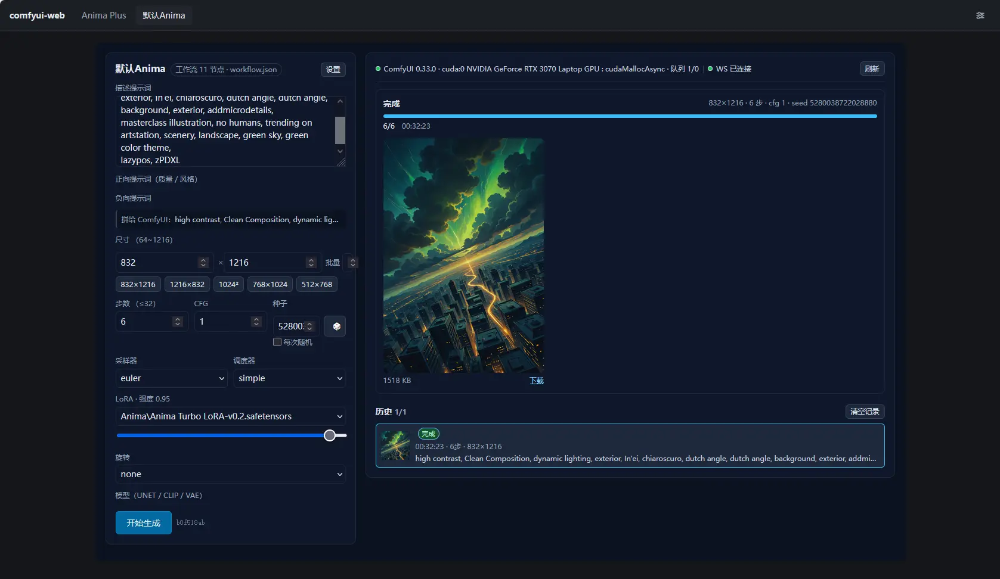
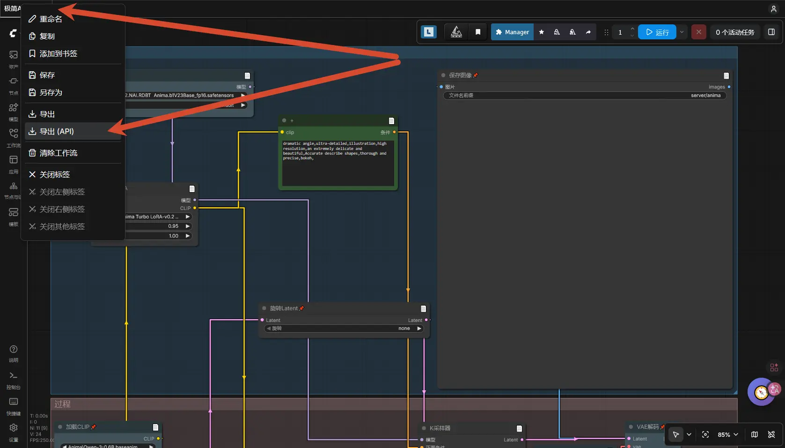

# comfyui-web

[](LICENSE)
[中文版](README.zh.md)

A lightweight frontend and workflow plugin host for ComfyUI: wrap a workflow in a web form, call it through the API, and keep all business logic in plugins.



## Why

In the agent era, turning a ComfyUI workflow into a frontend page no longer needs to be slow or expensive. Once a workflow is built it rarely changes; the real work is generating images. Wrapping the workflow in a web page that calls the API lets an AI add auxiliary features far more easily than modifying ComfyUI plugins. As a bonus, the Vue 3 single-page shell also solves the loading problems ComfyUI has on weak and mobile browsers. The original architecture notes are archived at [docs/archive/架构思路.md](docs/archive/架构思路.md) (Chinese, historical).

## Architecture

| Role | Location | Responsibility |
| --- | --- | --- |
| Host | `apps/server/` (:8087) | Framework only: loads plugins, routes by prefix, serves the web build, provides the settings page. Contains no business logic itself. |
| Shell | `apps/web/` | Tab bar + plugin pages + settings page. Vue is provided by the import map in `index.html`. |
| Plugin | `tabs/<id>/` (source in `plugins/<id>/`) | All business logic. A plugin is `tabs/<id>/` — directory name = id, the only thing the host loads. `plugins/*` is its source project; `pnpm build:plugins` writes it into `tabs/`. |

## Quick start

```bash
pnpm install

# development
pnpm dev            # build plugins once, then start host + shell
pnpm dev:host       # host on :8087 (tsx watch, restarts on src/ changes)
pnpm dev:web        # shell (vite :5173, proxies /api and /plugins to the host)
pnpm dev:plugins    # plugin artifact watcher (plugins/* source straight into tabs/)

# production: build a fully relocatable dist/
pnpm build          # → dist/app/server.mjs + dist/app/web/ + dist/tabs/ + dist/data/
node dist/app/server.mjs   # one process serves both the API and the frontend
```

Open `http://127.0.0.1:8087`. With no plugins installed you get only a welcome page and a settings page — by design.

Installing a plugin means dropping the built directory into `tabs/<id>/` (**directory name = id**) and clicking Rescan plugin directory on the settings page. The host does **not** watch the directory: loading happens only at startup and on that click (D20). **Rebuilding the host is never required** — acceptance check: `sha256(dist/app/**)` is byte-for-byte identical before and after.

```bash
pnpm build:plugins    # plugin source (plugins/<id>/) → tabs/<id>/
# hand-written tab: drop the directory straight into tabs/, no build step (see tabs/README.md)
```

## Developing plugins



ComfyUI can export a workflow as API-format JSON (pictured above). Hand that JSON to an AI coding harness and it can generate the plugin page and backend calls automatically. For the full walkthrough see [docs/README.md](docs/README.md) and [plugins/README.md](plugins/README.md).

## Documentation

| Topic | Read |
| --- | --- |
| How to run, install and write a plugin, directory conventions | **[docs/README.md](docs/README.md)** (the entry point) |
| Architecture and decisions (D1–D26), plugin contract, handle API | [docs/architecture.md](docs/architecture.md) |
| Which of the many config files belongs to which layer, who may edit, what is committed | [docs/config.md](docs/config.md) |
| Directory-style plugins (`tabs/`): usage and hot-reload behavior | [tabs/README.md](tabs/README.md) |
| Settings and internal structure of a plugin | the `README.md` inside that plugin |
| v1 monolith era, v2 process notes | [docs/archive/](docs/archive/README.md) (**history only, do not follow**) |

> The deep docs are currently Chinese-only. If an AI agent is developing in this repo, have it read [AGENTS.md](AGENTS.md) first (Chinese) — commands, environment pitfalls, hard rules, and doc discipline are all on that one page.

## Verify

```bash
pnpm verify          # typecheck → isolation → smoke → build → tabs-sync → contract; logs in .cache/verify/
pnpm -r typecheck
```
